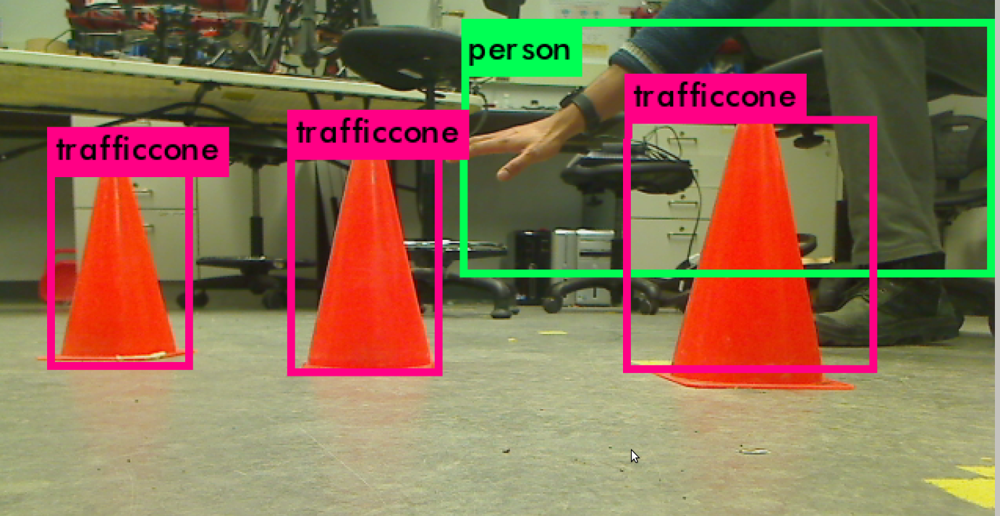

# duke-cone

Neural Network based Extended Kalman Filter Localization. For the reason behind the name, google duke cone :)

## Trained Model
Yolo was trained on traffic cone images.
- [Traffic cone dataset](https://www.dropbox.com/s/fag8b45ijv14noy/cone_dataset.tar.gz?dl=0) Collected from google
- [Yolo model](https://www.dropbox.com/sh/2sp9hkcg9twntvo/AABi0CitQr8ziLUnA5Zjpygwa?dl=0) Yolo trained on Pascal VOC + additional class (traffic cone) 

All code has been developed in Python (with the exception of external motion capture code), with Robot Operating System (ROS) wrappers and tested on Ubuntu 14.04.

Link to the demo video :
https://youtu.be/OcQGvapoJCg

 
## Requirements : Software
This project relies on the following open-source projects :
- [Yolo](https://github.com/pjreddie/darknet)
- [Tensorflow](https://www.tensorflow.org/)
- [Ros Indigo](http://wiki.ros.org/indigo)
- [Mocap optitrack](https://github.com/h2r/mocap_optitrack)
- [Yolo tf](https://github.com/gliese581gg/YOLO_tensorflow)
- [Image Annotation Tool](https://github.com/tzutalin/labelImg)

## Requirements : Hardware
- [Turtlebot Robot](https://www.clearpathrobotics.com/turtlebot-2-open-source-robot/)
- NVIDIA Titan X GPU
- Mocap_optitrack

## Description
An implementation of object-based localization method using convolutional neural networks.
The platform used for this project is the TurtleBot. This two-wheeled robot is equipped with a Microsoft Kinect camera and depth sensor, as well as an on-board gyroscope and wheel encoders.
Robot localization is a key problem in creating truly autonomous robots. If the robot is unable to determine where it is, it can be difficult to decide what to do next.
In order to localize itself, a robot has access to sensory information which provides the robot with feedback about its current location in the world. In this project we experimented with an object based
localization, as opposed to traditional feature based approaches.

